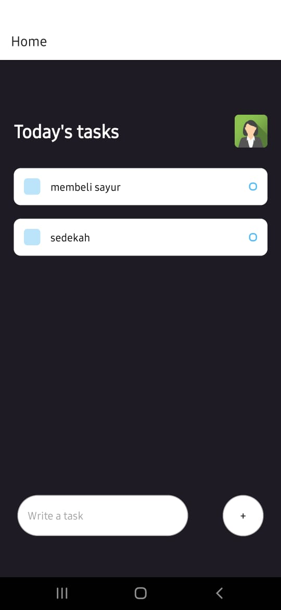
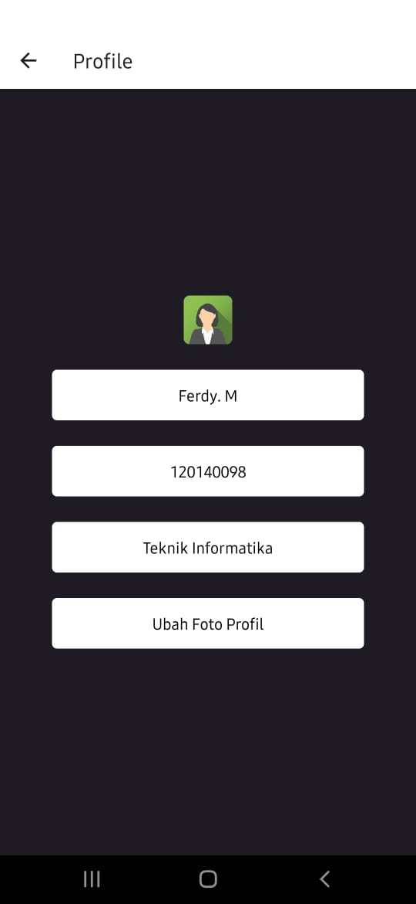

# UTS-PAM (todoList)

## Author

Ferdy. M - 120140098
Kelas : RB

### Description

todoList adalah sebuah aplikasi untuk mencatat hal-hal yang ingin dilakukan sehari-hari

### Dependencies

- React Native
- React Navigation
- React Native Stack
- Expo API

### How to run this app

1. Clone this repository

```bash
https://github.com/verdia20/uts-pam
```

2. Install all dependencies

```bash
npm install / npm install --global expo-cli
```

```bash
npm install @react-navigation/native @react-navigation/stack
```

3. Run the app

```bash
npm start / expo start --tunnel
```

4. Open the app

```bash
Open the app using Expo Go on your phone. Scan the QR code on the terminal or in the browser.
```

### How to build this app

1. Install Expo CLI

```bash
npm install -g expo-cli
```

2. Build the app

```bash
expo build:android
```

3. Download the app

```bash
Download the app from the link that is given on the terminal.
```

## Screenshoot

- Halaman 1
  

- Halaman 2
  

- Halaman 3
  
